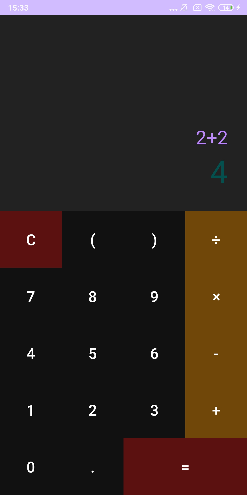

# BASIC CALCULATOR
## About the program
Simple calculator written in Kotlin. Calculates simple equations (e.g. ones using addition, substaction, multiplication and division). Has limited functionality. 
## Some more details:
- Minimum SDK version required: 24 (Android 7.0, Nougat); Target SDK version: 33 (Android 13, T)
- Was fully tested on Xiaomi Redmi Note 5, Android version 9 (Pie)
- release .apk file size: 4.39 Megabytes; being installed takes 14.34 Megabytes
- Is not a heavy program, takes only 0.2% of CPU on Redmi Note 5 being opened
- Needs no permissions (obviously)
- Built using Android Studio Flamingo | 2022.2.1
### Usage:
1. Find `app/release/app-release.apk` in the current repository and install it on phone.
You'll need to go to your phone settings and allow it to install from unknown sources (there are no viruses).
2. Once installed it is ready to go, the interface is pretty intuitive.
## Working program:

If you ran into some issues by any chance or need to contact the developer, it would be great to recieve your valuable feedback on email: *bilenko.a.uni@gmail.com*.

<table><td>
<a href="#start-of-content">↥ Scroll to top</a>
</td></table>

